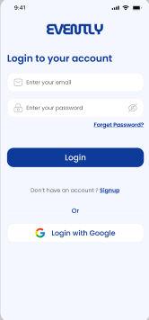
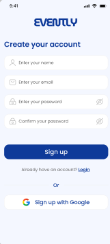
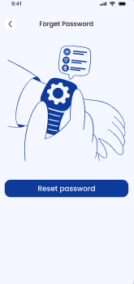
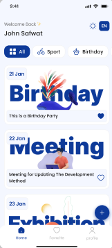
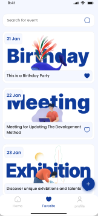
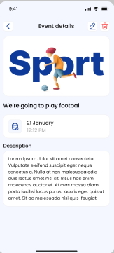
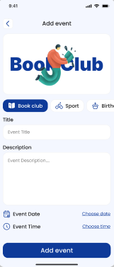
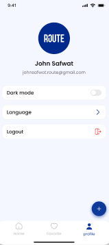

# 📅 Evently

### Task & Event Management App built with Flutter & Firebase

---

## 📖 Overview

**Evently** is a professional task and event management application.  
It helps users organize their daily activities, manage tasks efficiently, and create events بسهولة مع real-time data synchronization.

---

## 📸 Screenshots Gallery

---

### 1️⃣ Onboarding Experience
Simple and clean introduction screens to guide new users.

<p align="center">
  
  
</p>

---

### 2️⃣ Authentication Flow
Secure login system with full RTL & LTR support.

<p align="center">
  
  
  
</p>

---

### 3️⃣ Task Management & Search
Dynamic dashboard with advanced task filtering.

<p align="center">
  
  
  
</p>

---

### 4️⃣ Profile & Event Creation
Create new tasks and manage your profile .

<p align="center">
  
  
</p>

---

## 🌍 Localization

The app supports multiple languages:

- 🇪🇬 Arabic (RTL support)
- 🇺🇸 English (LTR support)
- 🔄 Dynamic language switching using `easy_localization`

---

## 🚀 Features

- ✅ Create and manage tasks بسهولة
- 🔍 Advanced task search
- 🔄 Real-time data updates
- 🔐 Secure authentication system
- 🌐 Multilingual support (Arabic / English)
- 📱 Fully responsive UI
- 🎯 Smooth and user-friendly experience

---

## 🛠️ Technologies Used

- **Flutter**
- **Provider (State Management)**
- **Firebase Authentication**
- **Cloud Firestore**
- **easy_localization**
- **flutter_screenUtil**

---

## 📂 Project Structure

```text
lib/
├── core/                    # App constants, themes, and shared resources
├── models/                  # Data models (Event, User, etc.)
├── Provider/                # State management (Provider)
├── screens/                 # Application screens
│   ├── add_event/           # Add new event screen
│   ├── authentication_screens/  # Login, Register, Forgot Password
│   ├── detils_event/        # Event details screen
│   ├── home_screen/         # Main dashboard
│   ├── localizing_screen/   # Language selection
│   ├── onbording_screen/    # Onboarding screens
├── firebase_options.dart    # Firebase configuration
└── main.dart               # App entry point